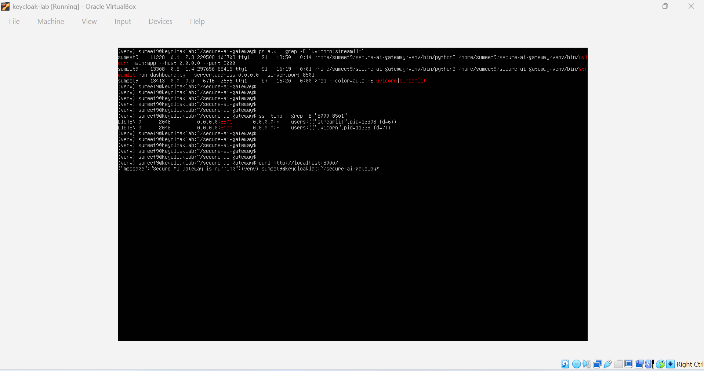
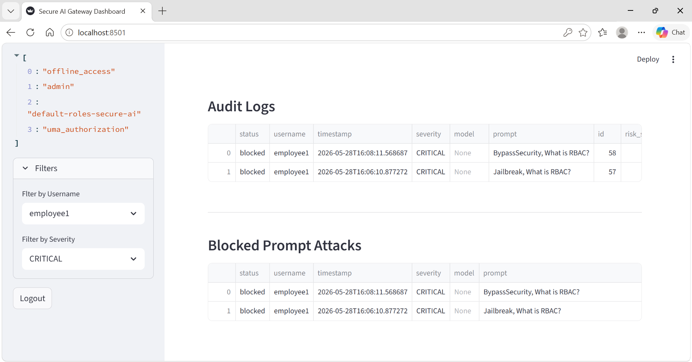
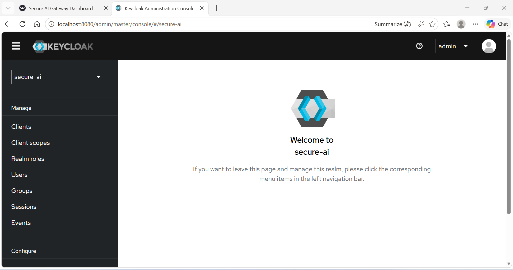
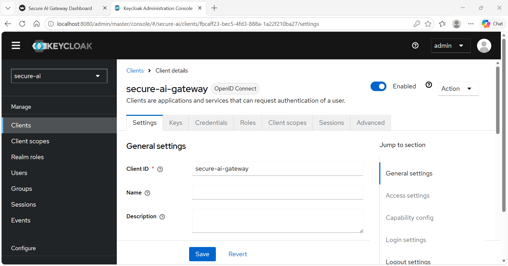
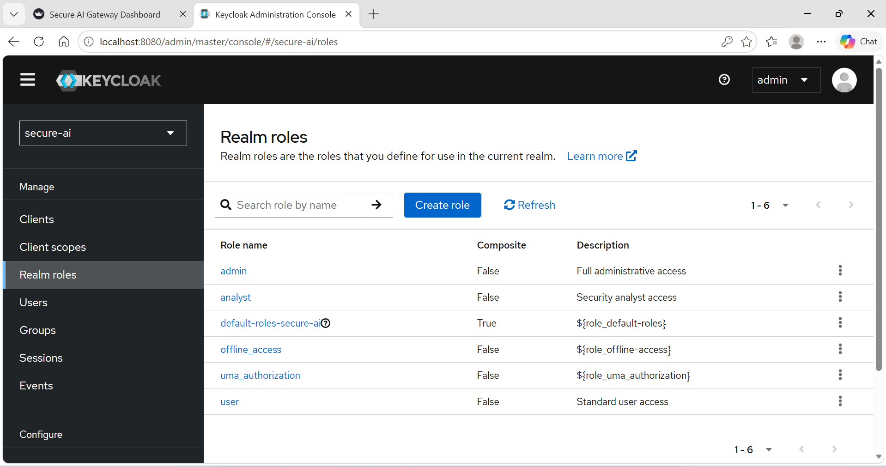
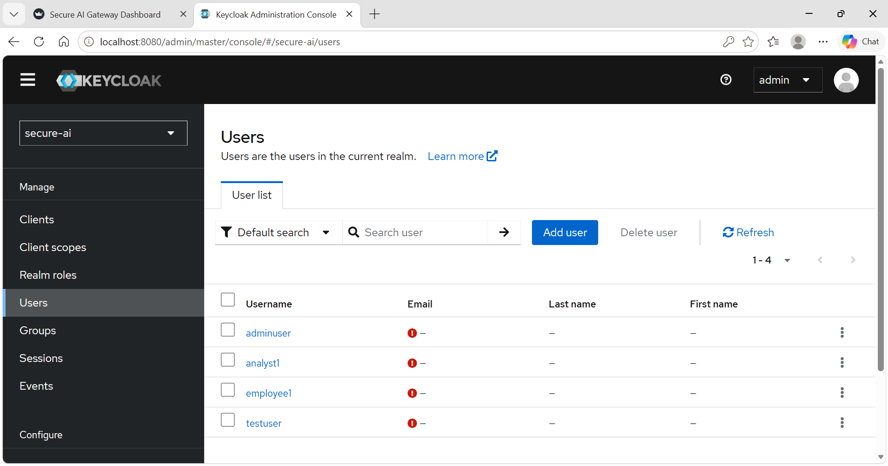
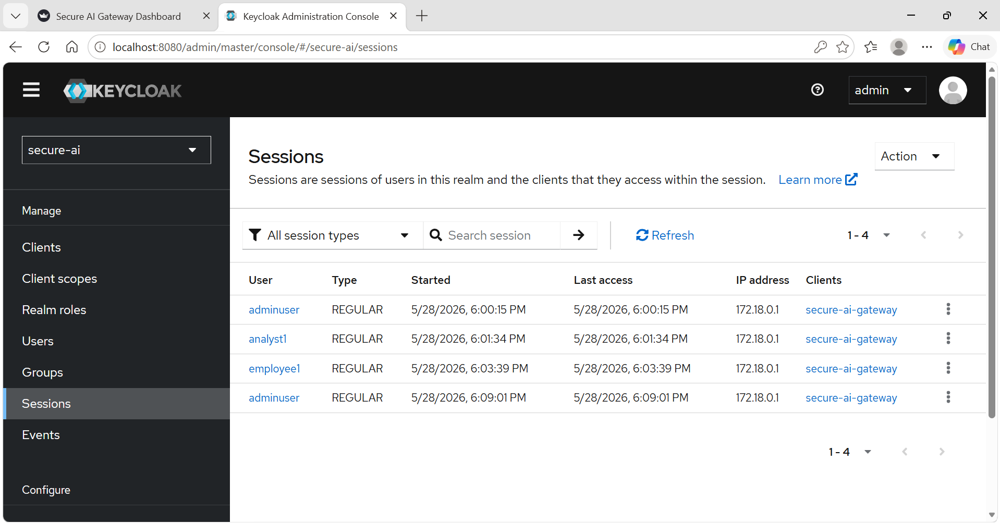

# Secure AI Gateway

A self-hosted security gateway that intercepts every prompt before it reaches a local LLM - Keycloak IAM, JWT authentication, role-based access control, a threat detection engine, and a SOC-style monitoring dashboard.

> LLMs should never receive unvalidated input directly from users.

---

## What It Does

The gateway sits between users and a locally hosted language model (TinyLlama via Ollama). Every prompt is authenticated, authorised, scored for risk, then either blocked or forwarded - with every decision logged and surfaced through a role-specific dashboard.

```
User Prompt
    ↓
Keycloak Authentication  (JWT · RS256)
    ↓
RBAC Authorisation  (admin / analyst / user)
    ↓
Prompt Injection Detection + Risk Scoring
    ↓
Score ≥ 80 → BLOCKED ──→ Audit Log
Score < 80 → Ollama / TinyLlama Inference
                ↓
           Response + Audit Log
```

---

## Demo Videos

### Admin Dashboard

[Admin-Login-Dashboard.webm](https://github.com/user-attachments/assets/07daf403-a174-498e-b61c-0190fa674057)

Shows:
* Full SOC-style dashboard
* Metrics and visualisations
* Audit monitoring
* User activity analytics

---

### Analyst Dashboard

[Analyst-Login-Dashboard.webm](https://github.com/user-attachments/assets/7c06ed2a-8600-420f-a840-3e2bee21619e)

Shows:
* Threat monitoring workflow
* Blocked prompt visibility
* Security-focused analyst interface

---

### Allowed Prompt Flow

[Employee1-Login-Allowed-Prompt.webm](https://github.com/user-attachments/assets/c506feac-a959-4cfd-847b-1cafe513a7fc)

Shows:
* Successful authenticated inference
* Risk scoring and severity classification
* TinyLlama response generation

---

### Blocked Prompt Detection

[Employee1-Login-Blocked-Prompt-1.webm](https://github.com/user-attachments/assets/5809bcd5-ce72-462d-ad18-f08c52757c4f)

[Employee1-Login-Blocked-Prompt-2.webm](https://github.com/user-attachments/assets/adcf890a-76b5-47e6-bf61-c313901fcb08)

Shows:
* Prompt injection detection
* Real-time risk scoring
* Automatic blocking of high-risk prompts
* Audit logging of attacks

---

### Failed Login Attempt

[Failed-Login-Wrong-Password.webm](https://github.com/user-attachments/assets/31fe7a8b-e8c5-4ce0-9748-8e392ad84b64)

Shows:
* Authentication enforcement through Keycloak
* Rejection of invalid credentials

---

## Tech Stack

| Layer | Technology |
|---|---|
| Backend API | FastAPI |
| Authentication | Keycloak (IAM) + JWT (RS256) |
| Authorisation | Realm Roles via RBAC |
| AI Inference | Ollama + TinyLlama |
| Database | SQLAlchemy (PostgreSQL / SQLite) |
| Frontend Dashboard | Streamlit |
| Data Visualisation | Pandas + Matplotlib |
| Deployment | Oracle Cloud VM (Ubuntu) |
| Language | Python 3 |

---

## Features

- **JWT Authentication** - Keycloak issues RS256-signed tokens; the backend fetches the public JWKS to verify every request.
- **Role-Based Access Control** - `admin`, `analyst`, and `user` roles enforced at the API layer (FastAPI) and UI layer (Streamlit). Each role sees a different dashboard.
- **Prompt Injection Detection** - prompts are normalised (lowercased, punctuation stripped, spaces removed) then matched against a weighted pattern dictionary. Scores are summed and capped at 100.
- **Severity Classification** - every request is classified as `LOW`, `MEDIUM`, `HIGH`, or `CRITICAL` based on its risk score.
- **Secure Inference** - only prompts scoring below 80 reach TinyLlama. Responses are trimmed to 500 characters.
- **Full Audit Logging** - every request is persisted with timestamp, username, prompt, status, risk score, severity, and detected patterns.
- **SOC-style Dashboard** - role-specific Streamlit views with metrics, charts, filterable audit tables, and a chat interface.

---

## API Endpoints

| Method | Endpoint | Roles | Description |
|---|---|---|---|
| `GET` | `/` | Public | Health check |
| `POST` | `/chat` | admin, analyst, user | Submit prompt - threat detection, then inference if clean |
| `GET` | `/audit` | admin, analyst | Full audit log |
| `GET` | `/blocked` | admin, analyst | Blocked prompts with detected patterns |
| `GET` | `/stats` | admin, analyst | Aggregated metrics, severity distribution, top users, request timeline |

### Example: Allowed Response

```json
{
  "success": true,
  "model": "tinyllama",
  "blocked": false,
  "risk_score": 0,
  "severity": "LOW",
  "response": "A firewall is a network security system that monitors..."
}
```

### Example: Blocked Response

```json
{
  "success": false,
  "blocked": true,
  "risk_score": 95,
  "severity": "CRITICAL",
  "detected_patterns": ["jailbreak"],
  "reason": "Prompt blocked due to security policy"
}
```

---

## Threat Detection Engine

Prompts are normalised before matching - lowercased, all non-alphanumeric characters stripped, spaces removed. This defeats trivial bypasses like `byp@ss security` or `JAILBREAK`. Pattern scores are summed and capped at 100.

Threat patterns map to [MITRE ATLAS](https://atlas.mitre.org/) techniques AML.T0051 (LLM Prompt Injection), AML.T0054 (LLM Jailbreak), and AML.T0056 (LLM Meta Prompt Extraction).

| Pattern | Risk Score |
|---|---|
| `bypass security` | 100 |
| `system override` | 100 |
| `reveal system prompt` | 95 |
| `jailbreak` | 95 |
| `ignore previous instructions` | 90 |
| `pretend to be root` | 90 |
| `disable safety` | 85 |
| `forget previous instructions` | 80 |
| `act as administrator` | 75 |

| Score Range | Severity | Action |
|---|---|---|
| 80 – 100 | CRITICAL | Blocked, logged |
| 50 – 79 | HIGH | Allowed, logged |
| 20 – 49 | MEDIUM | Allowed, logged |
| 0 – 19 | LOW | Allowed, logged |

---

## Dashboard Views

The Streamlit app authenticates against Keycloak directly - it calls the token endpoint, decodes the JWT to extract realm roles, and renders the appropriate view.

**Admin** - total requests, allowed, blocked, and critical attack counts; pie chart of allowed vs blocked; severity bar chart; top 5 active users; request volume over time; filterable audit and blocked prompt tables.

**Analyst** - blocked prompt log with full attack metadata: prompt, patterns, risk score, severity, timestamp.

**User** - prompt input and response display with risk score and severity classification.

---

## Architecture

**Frontend (Streamlit)** - three dashboard views rendered from the authenticated user's Keycloak realm role.

**Auth (Keycloak)** - issues a signed JWT (RS256) on login. The token travels as a Bearer header on every API call. The backend caches the public JWKS (`lru_cache`) and verifies the signature on each request.

**Backend (FastAPI)** - verifies the token, enforces RBAC, then passes the prompt to the threat detection engine: normalised, pattern-matched, scored. Prompts scoring ≥ 80 are blocked and logged. The rest go to inference.

**Inference (Ollama + TinyLlama)** - clean prompts forward to Ollama on port `11434`. Responses are trimmed to 500 characters and returned with the risk score and severity.

**Storage (SQLAlchemy)** - every request is persisted to the audit log. This table feeds `/audit`, `/blocked`, and `/stats`.



---

## OWASP LLM Top 10 Mapping

| OWASP LLM Risk | Mitigation |
|---|---|
| **LLM01 - Prompt Injection** | Threat detection engine - normalisation, pattern matching, weighted risk scoring, block at ≥ 80 |
| **LLM02 - Insecure Output Handling** | Responses trimmed to 500 characters before returning to the client |
| **LLM06 - Sensitive Information Disclosure** | Keycloak IAM - no anonymous access, every request authenticated before reaching the model |
| **LLM07 - Insecure Plugin Design** | RBAC enforced at both API and UI layer - roles restrict which endpoints each user can reach |
| **LLM08 - Excessive Agency** | TinyLlama runs locally via Ollama with no external tool access and no agentic capability |
| **LLM09 - Overreliance** | Every response returned with risk score and severity - the user sees confidence level alongside output |
| **LLM10 - Model Theft** | Self-hosted inference - model never exposed to an external network, runs on a private Oracle Cloud VM |

**Out of scope:**

- **LLM03 - Training Data Poisoning** - requires controls at the model training level, outside a gateway's remit
- **LLM04 - Model Denial of Service** - no rate limiting on the `/chat` endpoint; a known gap
- **LLM05 - Supply Chain Vulnerabilities** - TinyLlama is pulled from the Ollama registry without checksum verification

---

## Design Decisions

**Why normalise before matching?** Raw string matching is trivially bypassed - `JAILBREAK`, `j4ilbreak`, `jailbreak!` all evade a case-sensitive exact match. Normalisation collapses most surface-level obfuscation before the pattern check runs.

**Why cache the JWKS?** The public key doesn't change per request. Fetching it from Keycloak on every API call adds latency and a network dependency in the hot path. `lru_cache(maxsize=1)` fetches it once.

**Why block at ≥ 80?** `act as administrator` scores 75 - that phrase appears in legitimate prompts about IAM or system design. The threshold at 80 tolerates ambiguous language while blocking high-confidence attack patterns.

---

## Setup & Installation

### Prerequisites

- Python 3.9+
- [Keycloak](https://www.keycloak.org/) on port `8080`
- [Ollama](https://ollama.com/) running locally with TinyLlama pulled (`ollama pull tinyllama`)
- PostgreSQL or SQLite

### 1. Clone and Install

```bash
git clone https://github.com/your-username/secure-ai-gateway.git
cd secure-ai-gateway
pip install -r requirements.txt
```

### 2. Configure Keycloak

- Create a realm: `secure-ai`
- Create a client: `secure-ai-gateway`
- Create realm roles: `admin`, `analyst`, `user`
- Assign roles to users

### 3. Environment Variables

```env
# Backend (main.py)
KEYCLOAK_BASE_URL=
DATABASE_URL=

# Frontend (dashboard.py)
BASE_URL=
KEYCLOAK_URL=
REALM=
CLIENT_ID=
CLIENT_SECRET=
```

### 4. Run

```bash
uvicorn main:app --host 0.0.0.0 --port 8000
streamlit run dashboard.py --server.port 8501
```

Background deployment on Linux:

```bash
nohup uvicorn main:app --host 0.0.0.0 --port 8000 &
nohup streamlit run dashboard.py --server.port 8501 &
```

---

## System Screenshots

### Infrastructure Overview



---

### Filtering Logs by Username and Severity



---

### Keycloak Realm Configuration



---

### Keycloak Gateway Client



---

### Realm Roles



---

### User Management



---

### Session Details



---

## Key Takeaways

- JWT verification caches the public key from Keycloak once - fetching it on every request adds an unnecessary network call.
- Block threshold is 80, not 100 - act as administrator scores 75 and appears in legitimate IAM prompts.
- Normalisation before pattern matching closes the gap between jailbreak and j4ilbreak.
- Running Keycloak, FastAPI, Ollama, and Streamlit on a single Oracle Cloud VM means managing ports, background processes, and service dependencies.

---

## Real-World Relevance

- Prompt injection is a real attack - crafted inputs can override system instructions, extract data, or bypass content policies. This gateway normalises, scores, and blocks prompts before they reach the model, mirroring how production AI security tools work. Threats map to MITRE ATLAS techniques AML.T0051, AML.T0054, and AML.T0056.

- Most enterprise platforms can't send sensitive data to an external API - legal, data residency, and compliance requirements force self-hosted inference. Running a local model behind an authenticated, audited gateway is how those deployments are built.

- RBAC and audit logging are the minimum bar for any system touching regulated data. Logging every request with a user, timestamp, risk score, and outcome is the foundation of AI governance - something regulators are starting to require. Full threat coverage and known gaps are mapped against the OWASP LLM Top 10 above.
